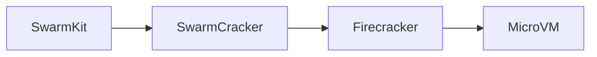
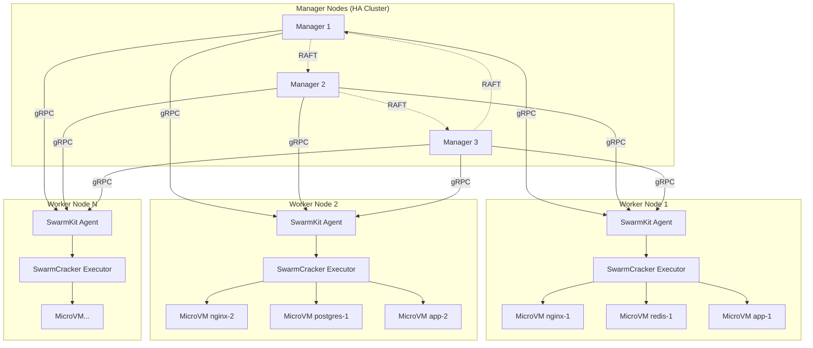

<div align="center">

# 🔥 SwarmCracker

<p align="center">
  
</p>

### Firecracker MicroVMs meet Docker Swarm Orchestration

[](https://goreportcard.com/report/github.com/restuhaqza/swarmcracker)
[](LICENSE)
[](https://github.com/restuhaqza/swarmcracker)
[](https://github.com/restuhaqza/swarmcracker)

**Hardware-isolated microVMs with the simplicity of Docker Swarm**

[Features](#-what-it-does) • [Quick Start](#-quick-start) • [Docs](#-documentation) • [Contributing](#-contributing)

</div>

---

<p align="center">
  <i>SwarmCracker is a custom executor for SwarmKit that runs containers as isolated Firecracker microVMs instead of traditional containers.</i>
</p>

SwarmCracker is a custom executor for [SwarmKit](https://github.com/moby/swarmkit) that runs containers as isolated [Firecracker](https://github.com/firecracker-microvm/firecracker) microVMs instead of traditional containers.

## ✨ What It Does

SwarmCracker brings you the best of both worlds:

| Feature | Benefit |
|---------|---------|
| 🔥 **MicroVM Isolation** | Each container gets its own kernel via KVM |
| 🐳 **Swarm Simplicity** | Use familiar Docker Swarm commands and workflows |
| 🚀 **Full Orchestration** | Services, scaling, rolling updates, secrets, configs |
| 🛡️ **Hardware Security** | KVM-based virtualization, not just kernel namespaces |
| ⚡ **Fast Startup** | MicroVMs boot in milliseconds with Firecracker |
| 🎯 **KVM-Free** | No Kubernetes complexity needed |

### Why SwarmCracker?

- **Stronger isolation than containers** - Full kernel separation via KVM
- **Simpler than Kubernetes** - Keep Swarm's easy-to-use interface
- **Better resource utilization** - MicroVMs are lighter than full VMs
- **Cloud-native** - Designed for microservices and distributed systems

## 🏗️ Architecture



### Deployment at Scale



**Key Features at Scale:**
- 🔄 **High Availability** - Manager nodes use RAFT for consensus
- 📊 **Load Distribution** - Tasks distributed across workers automatically
- 🔒 **Isolation** - Each microVM has its own kernel via KVM
- ⚡ **Elastic Scaling** - Add/remove workers on demand
- 🛡️ **Fault Tolerance** - MicroVM failures don't affect other workloads

**📖 See detailed architecture in [ARCHITECTURE.md](docs/ARCHITECTURE.md)**

### How It Works

1. **SwarmKit** assigns tasks to the agent (same as Docker Swarm)
2. **SwarmCracker Executor** translates tasks into MicroVM configurations
3. **Image Preparer** converts OCI images to root filesystems
4. **Network Manager** creates isolated TAP devices for each VM
5. **Firecracker VMM** launches hardware-isolated MicroVMs via KVM
6. **Workload** runs with full kernel separation

## 🚀 Quick Start

### Prerequisites

Before you begin, ensure you have:

- ✅ **Linux** with KVM support (`ls /dev/kvm`)
- ✅ **Go 1.21+** installed
- ✅ **Firecracker v1.0.0+** installed
- ✅ **Docker Swarm** initialized or SwarmKit standalone

### Installation

```bash
# Clone the repository
git clone https://github.com/restuhaqza/swarmcracker.git
cd swarmcracker

# Install dependencies
go mod download

# Build the binary
make build

# Install to $GOPATH/bin or /usr/local/bin
make install
```

### Basic Usage

#### CLI Tool Usage

The `swarmcracker` CLI provides a simple interface to run containers as microVMs:

```bash
# Validate configuration
swarmcracker validate --config /etc/swarmcracker/config.yaml

# Run a container as a microVM (test mode - validate only)
swarmcracker run --config /etc/swarmcracker/config.yaml --test nginx:latest

# Run with custom resources
swarmcracker run --vcpus 2 --memory 1024 nginx:latest

# Run in detached mode
swarmcracker run --detach nginx:latest

# Run with environment variables
swarmcracker run -e APP_ENV=production -e DEBUG=false nginx:latest

# Show version
swarmcracker version
```

#### SwarmKit Integration

```bash
# 1. Create a configuration file
cat > /etc/swarmcracker/config.yaml <<EOF
executor:
  kernel_path: "/usr/share/firecracker/vmlinux"
  rootfs_dir: "/var/lib/firecracker/rootfs"
  default_vcpus: 2
  default_memory_mb: 1024

network:
  bridge_name: "swarm-br0"
EOF

# 2. Start SwarmKit agent with SwarmCracker
swarmd \
  --addr 0.0.0.0:4242 \
  --remote-addrs <manager-ip>:4242 \
  --executor firecracker \
  --executor-config /etc/swarmcracker/config.yaml

# 3. Deploy services as microVMs
docker service create \
  --name nginx \
  --executor firecracker \
  nginx:latest
```

<details>
<summary><b>📖 See detailed installation guide</b></summary>

For detailed installation instructions, including:
- Firecracker setup
- Network bridge configuration
- Kernel preparation
- Troubleshooting tips

See the [Installation Guide](docs/INSTALL.md)

</details>

## 📚 Documentation

### Getting Started

| Document | Description |
|----------|-------------|
| [📖 Installation Guide](docs/INSTALL.md) | Step-by-step setup instructions for any environment |
| [⚙️ Configuration Reference](docs/CONFIG.md) | Complete configuration options with examples |
| [🏗️ Architecture](docs/ARCHITECTURE.md) | System design, components, and data flow |

### Development

| Document | Description |
|----------|-------------|
| [🤖 Agent Guide](AGENTS.md) | Project setup, architecture, and workflows for AI agents and contributors |
| [🧪 Testing Guide](docs/TESTING.md) | How to run and write tests |
| [💻 Development Guide](docs/DEVELOPMENT.md) | Contributing, workflow, and best practices |
| [📝 Project Status](PROJECT.md) | Progress tracking and roadmap |

### Quick Links

- 🚀 [Quick Start Guide](docs/INSTALL.md#installation-methods)
- ⚙️ [Configuration Examples](docs/CONFIG.md#examples)
- 🧪 [Running Tests](docs/TESTING.md#running-tests)
- 🤝 [Contributing](docs/DEVELOPMENT.md#contributing)


## 💻 CLI Reference

The `swarmcracker` CLI provides a comprehensive interface for running containers as Firecracker microVMs.

### Installation

```bash
# Build from source
go build -o swarmcracker ./cmd/swarmcracker/

# Install to /usr/local/bin
sudo cp swarmcracker /usr/local/bin/
sudo chmod +x /usr/local/bin/swarmcracker
```

### Available Commands

#### `run` - Run a container as a microVM

Run a container image as an isolated Firecracker microVM.

```bash
# Basic usage
swarmcracker run nginx:latest

# With custom resources
swarmcracker run --vcpus 2 --memory 1024 nginx:latest

# Run in detached mode (don't wait for completion)
swarmcracker run --detach nginx:latest

# With environment variables
swarmcracker run -e APP_ENV=production -e DEBUG=false nginx:latest

# Test mode (validate without running)
swarmcracker run --test nginx:latest
```

**Flags:**
- `--detach, -d` - Run in detached mode
- `--vcpus` - Number of vCPUs (default: 1)
- `--memory` - Memory in MB (default: 512)
- `--env, -e` - Environment variables (can be specified multiple times)
- `--test` - Test mode (validate without running)

#### `deploy` - Deploy to remote hosts via SSH

Deploy microVMs to remote hosts using SSH authentication.

```bash
# Deploy to multiple hosts
swarmcracker deploy nginx:latest --hosts host1.example.com,host2.example.com

# With custom SSH user
swarmcracker deploy --user ubuntu nginx:latest --hosts host1.example.com

# Using specific SSH key
swarmcracker deploy --ssh-key ~/.ssh/my_key nginx:latest --hosts host1.example.com

# Dry run (show what would be done)
swarmcracker deploy --dry-run nginx:latest --hosts host1,host2
```

**SSH Key Detection:**
The CLI automatically searches for SSH keys in this order:
1. `~/.ssh/swarmcracker_deploy` (SwarmCracker-specific key)
2. `~/.ssh/id_ed25519` (Modern default)
3. `~/.ssh/id_rsa` (Legacy RSA)

You can also specify a custom key with `--ssh-key`.

**Flags:**
- `--hosts` - Comma-separated list of remote hosts (required)
- `--user` - SSH user (default: "root")
- `--port` - SSH port (default: 22)
- `--ssh-key` - Path to SSH private key
- `--dry-run` - Show what would be done without executing

#### `validate` - Validate configuration

Validate the SwarmCracker configuration file.

```bash
# Validate default config
swarmcracker validate

# Validate specific config file
swarmcracker validate --config /etc/swarmcracker/config.yaml
```

#### `list` - List running microVMs

List all running SwarmCracker microVMs.

```bash
# List running VMs
swarmcracker list

# List all VMs including stopped ones
swarmcracker list --all

# Output in JSON format
swarmcracker list --format json
```

**Output:**
```
ID          STATUS    IMAGE           PID     STARTED
task-1234   Running ✓ nginx:alpine   12345   2m ago
```

**Flags:**
- `--all` - Show all VMs including stopped ones
- `--format` - Output format: table, json (default: "table")

#### `status` - Show detailed VM status

Display detailed information about a specific microVM.

```bash
# Show VM status
swarmcracker status nginx-1

# The status command shows:
# - Current state (running, stopped, error)
# - PID and uptime
# - Configuration (vCPUs, memory, kernel)
# - Container image and command
# - Network information
# - File locations (socket, log)
```

**Flags:**
None (takes VM ID as argument)

#### `logs` - View VM logs

Display logs from a Firecracker microVM.

```bash
# View all logs
swarmcracker logs nginx-1

# Follow log output (like tail -f)
swarmcracker logs --follow nginx-1

# Show last 100 lines
swarmcracker logs --tail 100 nginx-1

# Show logs from the last hour
swarmcracker logs --since 1h nginx-1

# Show logs from the last 30 minutes
swarmcracker logs --since 30m nginx-1
```

**Flags:**
- `--follow, -f` - Follow log output (stream new logs)
- `--tail` - Show last N lines (default: all)
- `--since` - Show logs since timestamp (e.g., 1h, 30m)

#### `stop` - Stop a running microVM

Stop a running SwarmCracker microVM gracefully or forcibly.

```bash
# Gracefully stop a VM (default 10s timeout)
swarmcracker stop nginx-1

# Force kill immediately
swarmcracker stop --force nginx-1

# Custom timeout (30 seconds)
swarmcracker stop --timeout 30 nginx-1
```

**Flags:**
- `--force, -f` - Force kill the VM (SIGKILL)
- `--timeout` - Graceful shutdown timeout in seconds (default: 10)

#### `version` - Show version information

Display detailed version information about the SwarmCracker CLI.

```bash
swarmcracker version
```

### Global Flags

These flags can be used with any command:

- `--config, -c` - Path to configuration file (default: `/etc/swarmcracker/config.yaml`)
- `--log-level` - Log level: debug, info, warn, error (default: "info")
- `--kernel` - Override kernel path from config
- `--rootfs-dir` - Override rootfs directory from config
- `--ssh-key` - SSH private key path for remote deployment

### Examples

#### Local Development

```bash
# Quick test with validation
swarmcracker run --test nginx:latest

# Run with debug logging
swarmcracker --log-level debug run nginx:latest

# Run with custom kernel
swarmcracker --kernel /path/to/vmlinux run nginx:latest
```

#### Remote Deployment

```bash
# Deploy to production hosts
swarmcracker deploy \
  --hosts web1.example.com,web2.example.com,web3.example.com \
  --user ubuntu \
  --ssh-key ~/.ssh/prod_key \
  nginx:latest

# Preview deployment changes
swarmcracker deploy --dry-run --hosts host1,host2 nginx:latest

# Deploy to custom SSH port
swarmcracker deploy --port 2222 --hosts host1.example.com nginx:latest
```

#### Configuration Override

```bash
# Use custom config file
swarmcracker --config ./test-config.yaml run nginx:latest

# Override specific settings
swarmcracker \
  --kernel /custom/path/vmlinux \
  --rootfs-dir /custom/path/rootfs \
  run nginx:latest
```

### SSH Key Setup

Generate a dedicated SSH key for SwarmCracker deployments:

```bash
# Generate new key pair
ssh-keygen -t ed25519 -f ~/.ssh/swarmcracker_deploy -C "swarmcracker@$(hostname)"

# Copy public key to remote hosts
ssh-copy-id -i ~/.ssh/swarmcracker_deploy.pub user@host.example.com

# Test SSH connection
ssh -i ~/.ssh/swarmcracker_deploy user@host.example.com

# Now deploy without specifying --ssh-key
swarmcracker deploy --hosts host1,host2 nginx:latest
```

**Security Best Practices:**
- Use dedicated SSH keys for SwarmCracker (not your personal key)
- Set appropriate permissions: `chmod 600 ~/.ssh/swarmcracker_deploy`
- Use key-based authentication (disable password auth)
- Regularly rotate deployment keys
- Use different keys for different environments

