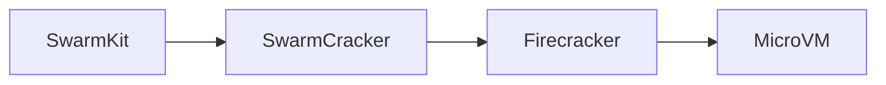
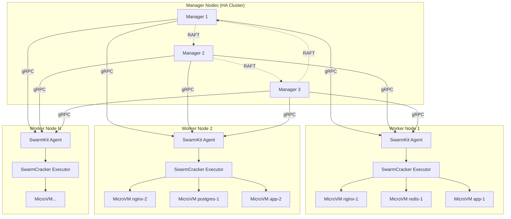

<div align="center">

# 🔥 SwarmCracker

<p align="center">
  
</p>

### Firecracker MicroVMs meet Docker Swarm Orchestration

[](https://goreportcard.com/report/github.com/restuhaqza/swarmcracker)
[](LICENSE)
[](https://github.com/restuhaqza/swarmcracker)
[](https://github.com/restuhaqza/swarmcracker)

**Hardware-isolated microVMs with the simplicity of Docker Swarm**

[Features](#-what-it-does) • [Quick Start](#-quick-start) • [Docs](#-documentation) • [Contributing](#-contributing)

</div>

---

<p align="center">
  <i>SwarmCracker is a custom executor for SwarmKit that runs containers as isolated Firecracker microVMs instead of traditional containers.</i>
</p>

SwarmCracker is a custom executor for [SwarmKit](https://github.com/moby/swarmkit) that runs containers as isolated [Firecracker](https://github.com/firecracker-microvm/firecracker) microVMs instead of traditional containers.

## ✨ What It Does

SwarmCracker brings you the best of both worlds:

| Feature | Benefit |
|---------|---------|
| 🔥 **MicroVM Isolation** | Each container gets its own kernel via KVM |
| 🐳 **Swarm Simplicity** | Use familiar Docker Swarm commands and workflows |
| 🚀 **Full Orchestration** | Services, scaling, rolling updates, secrets, configs |
| 🛡️ **Hardware Security** | KVM-based virtualization, not just kernel namespaces |
| ⚡ **Fast Startup** | MicroVMs boot in milliseconds with Firecracker |
| 🎯 **KVM-Free** | No Kubernetes complexity needed |

### Why SwarmCracker?

- **Stronger isolation than containers** - Full kernel separation via KVM
- **Simpler than Kubernetes** - Keep Swarm's easy-to-use interface
- **Better resource utilization** - MicroVMs are lighter than full VMs
- **Cloud-native** - Designed for microservices and distributed systems

## 🏗️ Architecture



### Deployment at Scale



**Key Features at Scale:**
- 🔄 **High Availability** - Manager nodes use RAFT for consensus
- 📊 **Load Distribution** - Tasks distributed across workers automatically
- 🔒 **Isolation** - Each microVM has its own kernel via KVM
- ⚡ **Elastic Scaling** - Add/remove workers on demand
- 🛡️ **Fault Tolerance** - MicroVM failures don't affect other workloads

**📖 See detailed architecture in [ARCHITECTURE.md](docs/ARCHITECTURE.md)**

### How It Works

1. **SwarmKit** assigns tasks to the agent (same as Docker Swarm)
2. **SwarmCracker Executor** translates tasks into MicroVM configurations
3. **Image Preparer** converts OCI images to root filesystems
4. **Network Manager** creates isolated TAP devices for each VM
5. **Firecracker VMM** launches hardware-isolated MicroVMs via KVM
6. **Workload** runs with full kernel separation

## 🚀 Quick Start

### Prerequisites

Before you begin, ensure you have:

- ✅ **Linux** with KVM support (`ls /dev/kvm`)
- ✅ **Go 1.21+** installed
- ✅ **Firecracker v1.0.0+** installed
- ✅ **Docker Swarm** initialized or SwarmKit standalone

### Installation

```bash
# Clone the repository
git clone https://github.com/restuhaqza/swarmcracker.git
cd swarmcracker

# Install dependencies
go mod download

# Build the binary
make build

# Install to $GOPATH/bin or /usr/local/bin
make install
```

### Basic Usage

#### CLI Tool Usage

The `swarmcracker-kit` CLI provides a simple interface to run containers as microVMs:

```bash
# Validate configuration
swarmcracker-kit validate --config /etc/swarmcracker/config.yaml

# Run a container as a microVM (test mode - validate only)
swarmcracker-kit run --config /etc/swarmcracker/config.yaml --test nginx:latest

# Run with custom resources
swarmcracker-kit run --vcpus 2 --memory 1024 nginx:latest

# Run in detached mode
swarmcracker-kit run --detach nginx:latest

# Run with environment variables
swarmcracker-kit run -e APP_ENV=production -e DEBUG=false nginx:latest

# Show version
swarmcracker-kit version
```

#### SwarmKit Integration

```bash
# 1. Create a configuration file
cat > /etc/swarmcracker/config.yaml <<EOF
executor:
  kernel_path: "/usr/share/firecracker/vmlinux"
  rootfs_dir: "/var/lib/firecracker/rootfs"
  default_vcpus: 2
  default_memory_mb: 1024

network:
  bridge_name: "swarm-br0"
EOF

# 2. Start SwarmKit agent with SwarmCracker
swarmd \
  --addr 0.0.0.0:4242 \
  --remote-addrs <manager-ip>:4242 \
  --executor firecracker \
  --executor-config /etc/swarmcracker/config.yaml

# 3. Deploy services as microVMs
docker service create \
  --name nginx \
  --executor firecracker \
  nginx:latest
```

<details>
<summary><b>📖 See detailed installation guide</b></summary>

For detailed installation instructions, including:
- Firecracker setup
- Network bridge configuration
- Kernel preparation
- Troubleshooting tips

See the [Installation Guide](docs/INSTALL.md)

</details>

## 📚 Documentation

### Getting Started

| Document | Description |
|----------|-------------|
| [📖 Installation Guide](docs/INSTALL.md) | Step-by-step setup instructions for any environment |
| [⚙️ Configuration Reference](docs/CONFIG.md) | Complete configuration options with examples |
| [🏗️ Architecture](docs/ARCHITECTURE.md) | System design, components, and data flow |

### Development

| Document | Description |
|----------|-------------|
| [🧪 Testing Guide](docs/TESTING.md) | How to run and write tests |
| [💻 Development Guide](docs/DEVELOPMENT.md) | Contributing, workflow, and best practices |
| [📝 Project Status](PROJECT.md) | Progress tracking and roadmap |

### Quick Links

- 🚀 [Quick Start Guide](docs/INSTALL.md#installation-methods)
- ⚙️ [Configuration Examples](docs/CONFIG.md#examples)
- 🧪 [Running Tests](docs/TESTING.md#running-tests)
- 🤝 [Contributing](docs/DEVELOPMENT.md#contributing)

## 🛠️ Configuration

SwarmCracker uses a simple YAML configuration file:

```yaml
# /etc/swarmcracker/config.yaml
executor:
  name: firecracker
  kernel_path: "/usr/share/firecracker/vmlinux"
  initrd_path: "/usr/share/firecracker/initrd.img"
  rootfs_dir: "/var/lib/firecracker/rootfs"
  socket_dir: "/var/run/firecracker"
  default_vcpus: 2
  default_memory_mb: 1024
  enable_jailer: true
  jailer:
    uid: 1000
    gid: 1000
    chroot_base_dir: "/srv/jailer"
network:
  bridge_name: "swarm-br0"
  enable_rate_limit: true
  max_packets_per_sec: 10000
```

## 🔧 Development

### Build & Test

```bash
# Run all tests
make test

# Run with coverage
make test

# Run linters
make lint

# Format code
make fmt

# Build release binaries
make release
```

### Test Coverage

```
pkg/translator     ████████████████████ 98.1%
pkg/executor       ███████████████████░ 95.2%
pkg/config         ██████████████████░░ 87.3%
pkg/lifecycle      ███████████░░░░░░░░░ 54.4%
pkg/network       ██░░░░░░░░░░░░░░░░░░  9.1%
───────────────────────────────────────
Overall           ███████████████░░░░░ 63.3%
```

## 📊 Project Status

**Version:** `v0.1.0-alpha` (Proof of Concept)

<details>
<summary><b>📈 Component Progress</b></summary>

| Component | Status | Coverage | Notes |
|-----------|--------|----------|-------|
| Executor | ✅ Complete | 95.2% | Full lifecycle management |
| Translator | ✅ Complete | 98.1% | Task → VM config conversion |
| Config | ✅ Complete | 87.3% | Validation & migration |
| Lifecycle | ✅ Complete | 54.4% | VM start/stop/monitor |
| Image Prep | ✅ Complete | ⏳ Pending | OCI → rootfs conversion |
| Network | ✅ Complete | 9.1% | TAP/bridge management |
| Jailer | ⏳ Ready | ⏳ Pending | Security hardening |
| CLI Tool | ✅ Complete | ✅ Done | Full CLI with Cobra |

</details>

<details>
<summary><b>🎯 Roadmap</b></summary>

### 📅 Short Term (This Week)
- [ ] Complete image preparer tests
- [ ] Implement `swarmcracker-kit` CLI
- [ ] Add integration tests

### 📅 Medium Term (Next Month)
- [ ] Jailer integration and testing
- [ ] Performance optimization
- [ ] Alpha release (v0.2.0)

### 📅 Long Term (Next Quarter)
- [ ] Production deployment
- [ ] VM snapshot support
- [ ] Live migration between hosts

</details>

## 🤝 Contributing

We welcome contributions! SwarmCracker is a community-driven project.

### Ways to Contribute

- 🐛 **Report bugs** - Open an issue with reproducible examples
- 💡 **Suggest features** - Share your ideas in discussions
- 🔧 **Submit PRs** - Fix bugs, add features, improve docs
- 📖 **Improve docs** - Help make documentation clearer
- 🧪 **Add tests** - Improve test coverage

### Getting Started

1. Read the [Development Guide](docs/DEVELOPMENT.md)
2. Check [Good First Issues](https://github.com/restuhaqza/swarmcracker/labels/good%20first%20issue)
3. Follow [Contributing Guidelines](CONTRIBUTING.md)
4. Join our [Discord community](https://discord.gg/clawd)

<details>
<summary><b>🎨 Code Style Guidelines</b></summary>

- Follow Go best practices and Effective Go
- Use `gofmt` for formatting
- Write tests for all public functions
- Add comments for exported types and functions
- Keep functions small and focused
- Use table-driven tests for multiple cases

</details>

## 📝 License

Apache License 2.0 - see [LICENSE](LICENSE) for details.

## 🙏 Acknowledgments

Built with love and these amazing projects:

| Project | Purpose | License |
|---------|---------|---------|
| [SwarmKit](https://github.com/moby/swarmkit) | Orchestration engine | Apache 2.0 |
| [Firecracker](https://github.com/firecracker-microvm/firecracker) | MicroVM technology | Apache 2.0 |
| [firecracker-containerd](https://github.com/firecracker-microvm/firecracker-containerd) | Container integration reference | Apache 2.0 |

## 📜 License

Apache License 2.0 - see [LICENSE](LICENSE) for details.

## 🔗 Useful Links

- [SwarmKit Documentation](https://github.com/moby/swarmkit)
- [Firecracker Documentation](https://github.com/firecracker-microvm/firecracker)
- [Docker Swarm Guide](https://docs.docker.com/engine/swarm/)
- [KVM Documentation](https://www.linux-kvm.org/page/Documents)

---

<div align="center">

### ⭐ Star us on GitHub — it helps!

[](https://github.com/restuhaqza/swarmcracker/stargazers)
[](https://github.com/restuhaqza/swarmcracker/network/members)

**Made with 🔥 by [Restu Muzakir](https://github.com/restuhaqza)**

[Website](https://restuhaqza.github.io) • [Blog](https://restuhaqza.github.io/blog) • [Twitter](https://twitter.com/restuhaqza)

</div>
