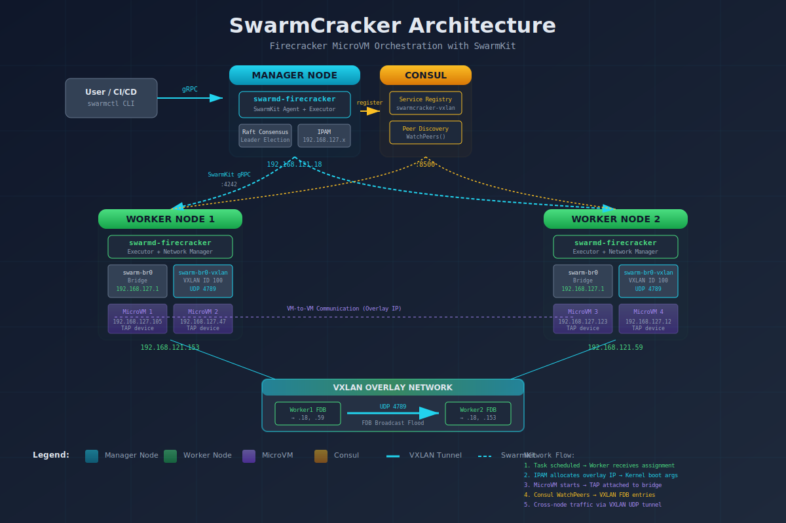

<div align="center">

# SwarmCracker

Firecracker MicroVMs with SwarmKit Orchestration

[](https://goreportcard.com/report/github.com/restuhaqza/swarmcracker)
[](LICENSE)
[](https://github.com/restuhaqza/SwarmCracker/releases)

</div>

---

Imagine running containers, but with actual VMs instead. That's SwarmCracker — SwarmKit tasks become Firecracker microVMs, each with its own kernel and hardware-level isolation.

## Why You'll Like It

| Feature | What it means for you |
|---------|----------------------|
| Per-VM kernel | Real isolation — not just namespace walls |
| SwarmKit compatible | Everything you know from Docker Swarm just works |
| Hardware virtualization | KVM gives you actual VM security |
| Fast boot | MicroVMs boot in ~100ms — faster than you can blink |
| Cross-node networking | VXLAN connects your VMs across the whole cluster |
| Rolling updates | Deploy without taking anything offline |

## How It Works



### The Moving Parts

| Piece | What it does |
|------|-------------|
| Manager | Runs SwarmKit, hands out IPs, schedules tasks |
| Worker | Launches Firecracker VMs using swarmd-firecracker |
| Consul | Helps VMs find each other across the network |
| swarm-br0 | Local bridge that VMs plug into |
| swarm-br0-vxlan | VXLAN overlay (ID 100, UDP 4789) for cross-node traffic |
| MicroVMs | Your actual workloads, each with its own kernel |

### How Traffic Flows

```
Manager schedules a task
    → Worker picks it up
    → IPAM gives it an overlay IP
    → Firecracker boots the VM
    → TAP device connects to the bridge
    → Consul tells everyone about the new peer
    → Other workers update their forwarding tables
    → VMs can talk across the entire cluster
```

### VXLAN Cross-Node Networking

VMs on different workers talk through VXLAN:

- Overlay network: `192.168.127.0/24`
- Underlay: Your regular physical network
- VXLAN ID: 100, Port: 4789 (UDP)
- Peer discovery: Consul's `WatchPeers()` keeps forwarding tables up to date

**We've tested this (May 2026):**

| Test | Packets | Latency |
|------|---------|---------|
| Worker1 → Worker2 VM | 10/10, no drops | 4-8ms |
| Worker2 → Worker1 VM | 5/5, clean | 3-11ms |

**The code that makes it work:**

| File | What it does |
|------|--------------|
| `pkg/swarmkit/executor.go` | Auto-detects local IP for Consul |
| `pkg/network/vxlan.go` | Uses `fdb append` so multiple peers can coexist |
| `pkg/discovery/consul.go` | Queries Consul catalog for UDP services |

## Quick Start

### Set Up the Manager

```bash
sudo swarmcracker init

# Or specify which IP to advertise
sudo swarmcracker init --advertise-addr 192.168.1.10:4242
```

### Grab Your Join Token

```bash
sudo cat /var/lib/swarmkit/join-tokens.txt
```

### Add Workers to the Cluster

```bash
sudo swarmcracker join 192.168.1.10:4242 --token SWMTKN-1-...
```

---

### One-Line Install

```bash
curl -fsSL https://raw.githubusercontent.com/restuhaqza/SwarmCracker/main/install.sh | bash
```

This sets up Firecracker, jailer, and all the SwarmCracker binaries.

---

### What You Need

- Linux with KVM (check with `ls /dev/kvm`)
- Firecracker v1.14+ (the install script sets this up)
- Go 1.24+ (only if you're building from source)

### Building From Source

```bash
git clone https://github.com/restuhaqza/swarmcracker.git
cd swarmcracker
make all
```

### Running Services

```bash
swarmcracker deploy nginx:alpine --hosts worker-1,worker-2  # Deploy to specific workers
swarmcracker run nginx:alpine                               # Run locally
swarmcracker status                                         # See what's up
```

---

### Manual Setup (If You Like Things Explicit)

```bash
# Manager
swarmd -d /tmp/manager --listen-control-api /tmp/manager/swarm.sock \
  --hostname manager --listen-remote-api 0.0.0.0:4242

# Get the token
swarmctl --socket /tmp/manager/swarm.sock cluster inspect default

# Worker
swarmd-firecracker --hostname worker-1 \
  --join-addr <manager>:4242 --join-token <TOKEN> \
  --kernel-path /usr/share/firecracker/vmlinux \
  --rootfs-dir /var/lib/firecracker/rootfs

# Run something
swarmctl --socket /tmp/manager/swarm.sock service create --name nginx --image nginx:alpine
```

## Documentation

| Guide | What's inside |
|-------|---------------|
| [Getting Started](docs/user/getting-started/) | Setup walkthrough, step by step |
| [Networking](docs/user/guides/networking.md) | VXLAN, bridges, how VMs talk to each other |
| [SwarmKit](docs/user/guides/swarmkit.md) | Managing services like a pro |
| [Architecture](docs/user/architecture/) | How everything fits together |
| [CLI Reference](docs/user/reference/cli.md) | Every command, explained |

## Grab a Release

```bash
curl -LO https://github.com/restuhaqza/SwarmCracker/releases/download/v0.6.0/swarmcracker-v0.6.0-linux-amd64.tar.gz
tar xzf swarmcracker-v0.6.0-linux-amd64.tar.gz
```

[All releases](https://github.com/restuhaqza/SwarmCracker/releases)

## Want to Contribute?

Check out [CONTRIBUTING.md](CONTRIBUTING.md) — we'd love your help!

## License

Apache 2.0
