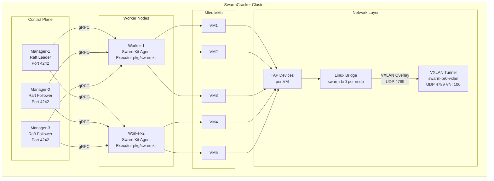
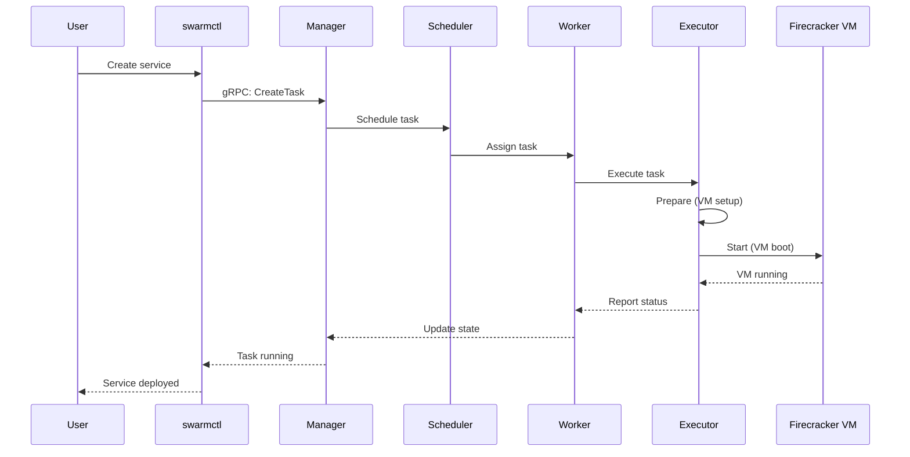
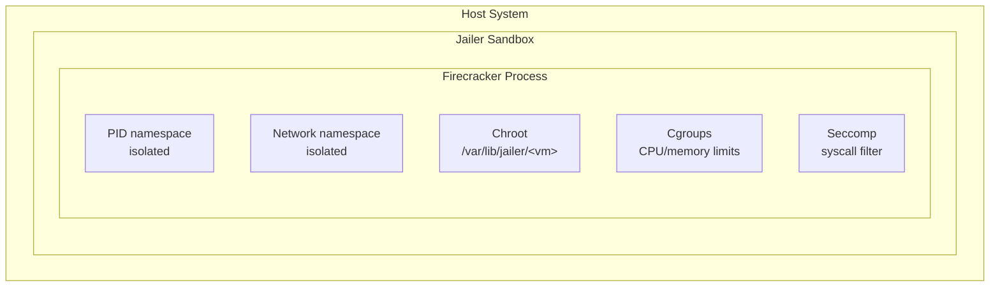
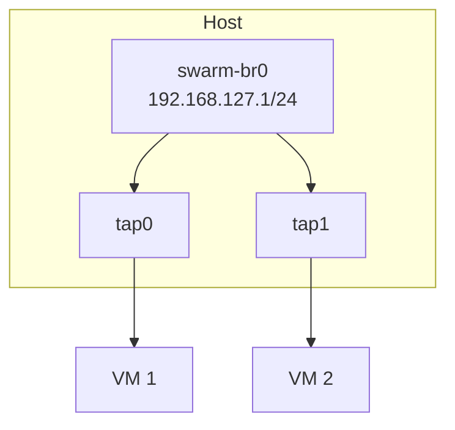
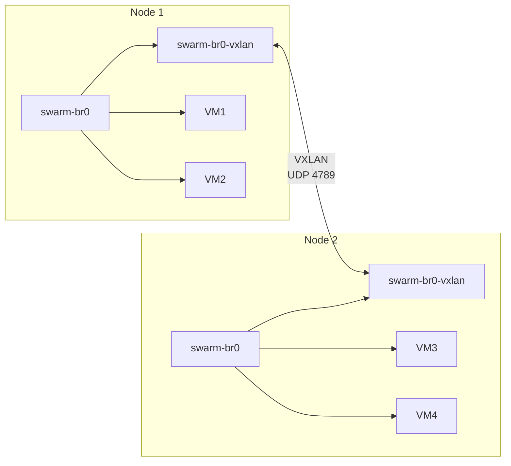

> System design, components, and integration details.

SwarmCracker is a Firecracker microVM orchestrator built on SwarmKit. It transforms SwarmKit container tasks into hardware-isolated Firecracker microVMs, providing per-VM kernel isolation without the complexity of Kubernetes.

---

## System Architecture



---

## Components

### SwarmKit Manager

| Component | Purpose |
|-----------|---------|
| **Raft Consensus** | Distributed decision making |
| **Scheduler** | Assigns tasks to workers |
| **State Store** | In-memory cluster state |
| **Control API** | gRPC for `swarmctl` |

### SwarmKit Worker

| Component | Purpose |
|-----------|---------|
| **Agent** | Communicates with manager |
| **Executor** | Runs tasks (SwarmCracker) |
| **Status Reporter** | Reports task state |

### SwarmCracker Executor

| Component | Purpose |
|-----------|---------|
| **Task Translator** | SwarmKit task → Firecracker config |
| **VM Manager** | Start/stop microVMs |
| **Network Setup** | TAP devices, bridges |
| **Jailer Integration** | Security sandboxing |

---

## Code Layout

There are two executor stacks in the tree. Both satisfy the same `pkg/types`
interfaces, but they are wired into different entry points:

| Path | Used by | Contents |
|------|---------|----------|
| `pkg/swarmkit/` | `swarmd-firecracker` daemon | `executor.go` (`Executor` + per-task `Controller`), `translator.go` (`taskTranslatorImpl`), `vmm.go` (`VMMManager`) |
| `pkg/executor/` + `pkg/translator/` + `pkg/lifecycle/` | `swarmcracker` CLI (direct `vm ...` commands) | `FirecrackerExecutor`, `TaskTranslator`, and a separate `VMMManager` |

For a real cluster the SwarmKit path is the one in use: `pkg/swarmkit`
implements SwarmKit's `swarmkit_exec.Executor` interface and is wired into the
agent by `cmd/swarmd-firecracker`. The `pkg/executor` / `pkg/translator` /
`pkg/lifecycle` stack powers direct VM management from the `swarmcracker` CLI.

### Core Packages

| Package | Description |
|---------|-------------|
| `pkg/config` | YAML configuration loading and validation |
| `pkg/swarmkit` | SwarmKit executor, controller, translator, and VMM (daemon path) |
| `pkg/executor` | `FirecrackerExecutor` (standalone CLI path) |
| `pkg/translator` | Task → Firecracker config translation (standalone CLI path) |
| `pkg/lifecycle` | `VMMManager` for CLI-managed VMs |
| `pkg/network` | TAP/bridge/VXLAN orchestration |
| `pkg/discovery` | Consul-based peer discovery (`consul.go`) |
| `pkg/image` | OCI image → ext4 rootfs, init injection |
| `pkg/jailer` | cgroups, seccomp, and chroot sandboxing |
| `pkg/storage` | Volume, secret, and config management |
| `pkg/snapshot` | VM snapshot and restore |
| `pkg/metrics` | Prometheus metrics |
| `pkg/health` | Health check server (`127.0.0.1:8080`) |
| `pkg/console` | VM console server (for `vm attach`) |
| `pkg/types` | Shared interfaces and data structures |

---

## Data Flow

### Task Execution Flow



### Image Preparation Pipeline

1. Pull the OCI image (remote or from the local cache).
2. Extract the layers into a temporary directory.
3. Detect the init system (`tini`, `dumb-init`, `systemd`, or `none`).
4. Inject an init system if the image does not provide one.
5. Build an ext4 filesystem and cache it at
   `/var/lib/firecracker/rootfs/<image-id>.ext4`.

---

## Deployment Topology

### Single-Node Development

One `swarmd-firecracker` process runs as both manager and worker with a
single-node Raft, backed by the local `swarm-br0` bridge
(`192.168.127.1/24`).

### Production Cluster (HA)

Three or more manager nodes form a Raft quorum behind a load balancer on port
4242. Worker nodes run the executor and connect to each other over the VXLAN
overlay (UDP 4789, VNI 100). Consul discovers peers and feeds the VXLAN
forwarding database.

---

## Security Model

### Jailer Isolation



The `pkg/jailer` package drives chroot, UID/GID drop, namespaces, cgroup
limits, and the Firecracker jailer integration.

---

## Networking Model

### Single Node



### Multi-Node (VXLAN)



The overlay interface is created as `<bridge>-vxlan`, so the default is
`swarm-br0-vxlan`. It uses VNI 100 over UDP 4789. Peers are learned from
Consul (`pkg/discovery/consul.go`) and programmed into the VXLAN forwarding
database.

---

## Resource Limits

| Resource | Default | Configurable |
|----------|---------|--------------|
| VM vCPUs | 1 | `executor.default_vcpus` or task spec |
| VM Memory | 512 MB | `executor.default_memory_mb` or task spec |
| VM Disk | 1 GB | rootfs size (image-dependent) |
| CPU Quota | Unlimited | `cgroup.cpu_quota` |
| Memory Limit | VM RAM | `cgroup.memory_limit` |

Task specs can override the defaults:

```yaml
# SwarmKit service spec
resources:
  limits:
    nano_cpus: 2000000000    # 2 vCPUs
    memory_bytes: 1073741824 # 1 GiB
```

---

## Related Documentation

| Topic | Document |
|-------|----------|
| SwarmKit integration | [SwarmKit Integration](/architecture/swarmkit/) |
| Network internals | [Network Reference](/contributing/reference/network/) |
| VM lifecycle | [Lifecycle Reference](/contributing/reference/lifecycle/) |
| Storage drivers | [Storage Reference](/contributing/reference/storage/) |
| Image preparation | [Image Reference](/contributing/reference/image/) |
| Security isolation | [Security Guide](/contributing/security/) |
| Networking guide | [Networking Guide](/guides/networking/) |
| Operations | [Operations Guide](/guides/operations/) |
| CLI commands | [CLI Reference](/reference/cli/) |

---

**See Also:** [Getting Started](/getting-started/) | [Guides](/guides/) | [Home](/)
