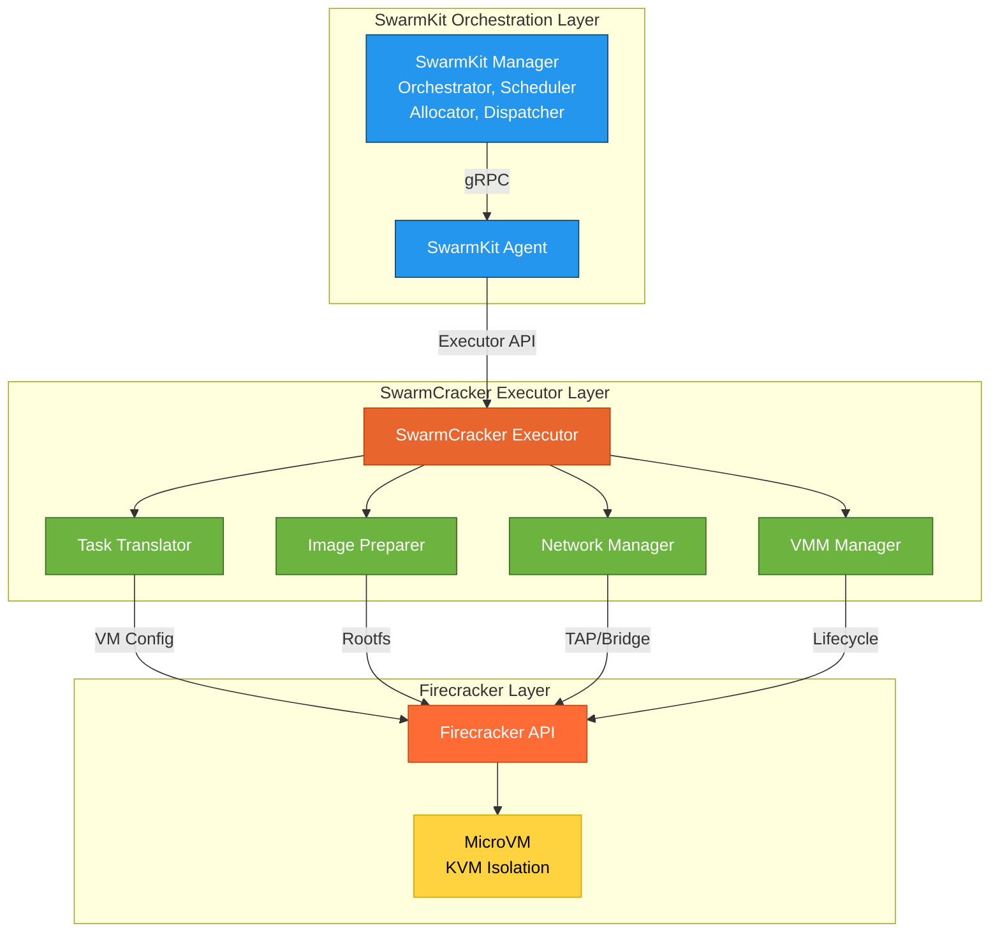
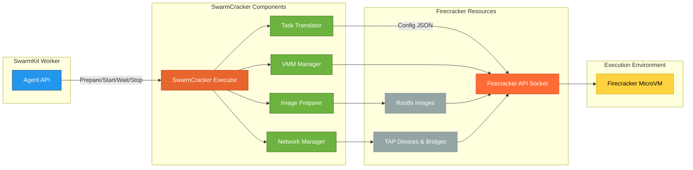
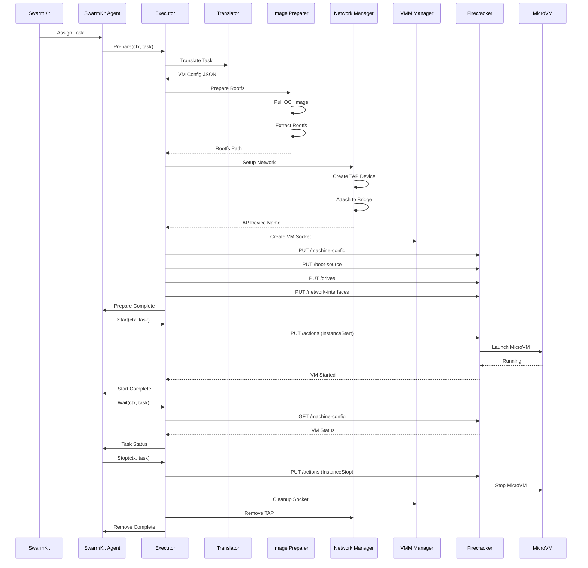
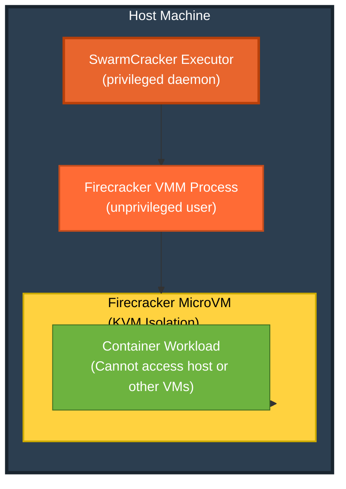

# SwarmCracker Architecture

## High-Level Architecture



## Component Overview

SwarmCracker bridges SwarmKit orchestration with Firecracker microVMs through a pluggable executor architecture.

## Detailed Component Flow



## Package Structure

| Package | Purpose | Status | Test Coverage |
|---------|---------|--------|---------------|
| `pkg/types` | Shared data structures & interfaces | ✅ Complete | N/A |
| `pkg/executor` | Main executor implementation | ✅ Complete | 95.2% |
| `pkg/translator` | Task → VM config conversion | ✅ Complete | 98.1% |
| `pkg/config` | Configuration management | ✅ Complete | 87.3% |
| `pkg/lifecycle` | VM start/stop/monitor | ✅ Complete | 54.4% |
| `pkg/network` | TAP/bridge network management | ✅ Complete | 9.1% |
| `pkg/image` | OCI image → root filesystem | ✅ Complete | 0% (pending) |
| `test/mocks` | Mock implementations for testing | ✅ Complete | N/A |

## Data Flow

### Sequence Diagram



### Process Flow

1. **Task Assignment** - SwarmKit dispatcher assigns task to agent
2. **Translation** - Task translator converts to Firecracker config
3. **Image Prep** - OCI image converted to root filesystem
4. **Network Setup** - TAP devices created and attached
5. **VM Launch** - Firecracker VMM starts microVM
6. **Monitoring** - Executor tracks VM status
7. **Cleanup** - On completion, resources are freed

## Integration Points

### With SwarmKit

SwarmCracker implements the `executor.Executor` interface from SwarmKit:

```go
type Executor interface {
    Prepare(ctx context.Context, t *Task) error
    Start(ctx context.Context, t *Task) error
    Wait(ctx context.Context, t *Task) (*TaskStatus, error)
    Stop(ctx context.Context, t *Task) error
    Remove(ctx context.Context, t *Task) error
}
```

### With Firecracker

SwarmCracker uses Firecracker's REST API:

```bash
PUT /boot-source      # Configure kernel
PUT /machine-config   # Set resources
PUT /drives           # Attach rootfs & volumes
PUT /network-interfaces  # Setup networking
PUT /actions          # Start/stop VM
```

## Security Model



### Security Boundaries

| Layer | Privilege Level | Isolation Mechanism |
|-------|----------------|---------------------|
| **SwarmCracker Executor** | Privileged (root) | Systemd service limits |
| **Firecracker VMM** | Unprivileged user | User namespace, chroot |
| **MicroVM** | None | KVM hardware virtualization |
| **Workload** | None | Kernel namespace isolation |

## Future Enhancements

- [ ] VM snapshot support for instant startup
- [ ] Live migration between hosts
- [ ] Custom metrics via vsock
- [ ] exec into container
- [ ] Log aggregation
- [ ] Health check integration
