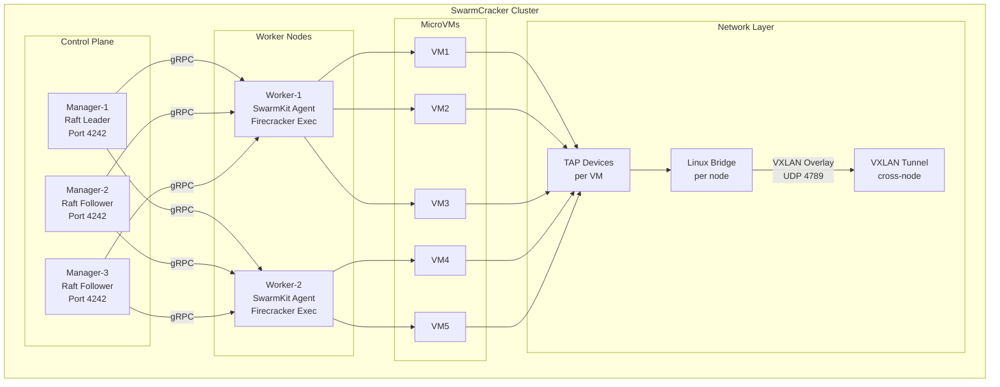
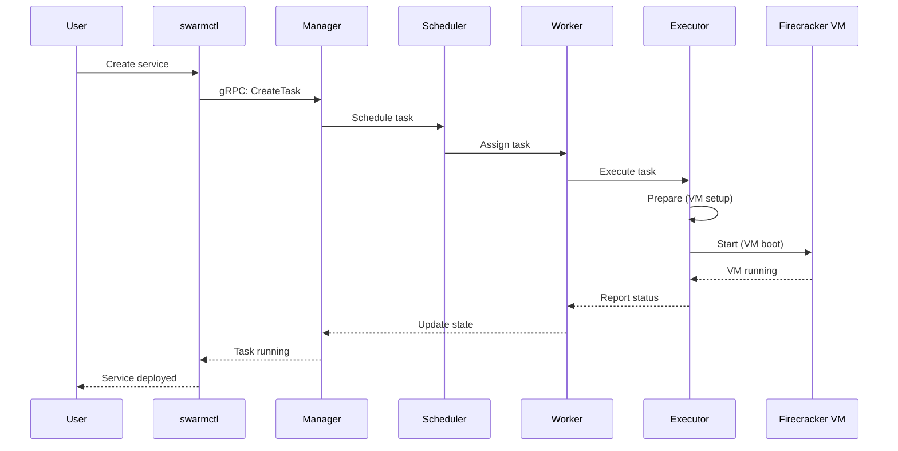
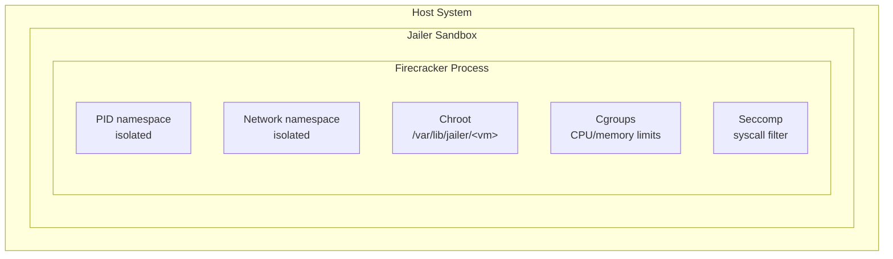
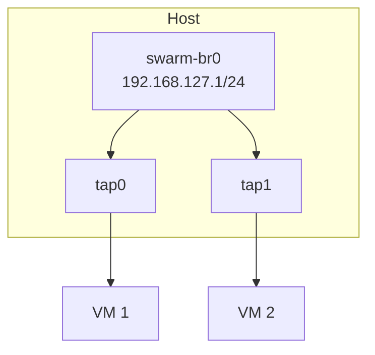
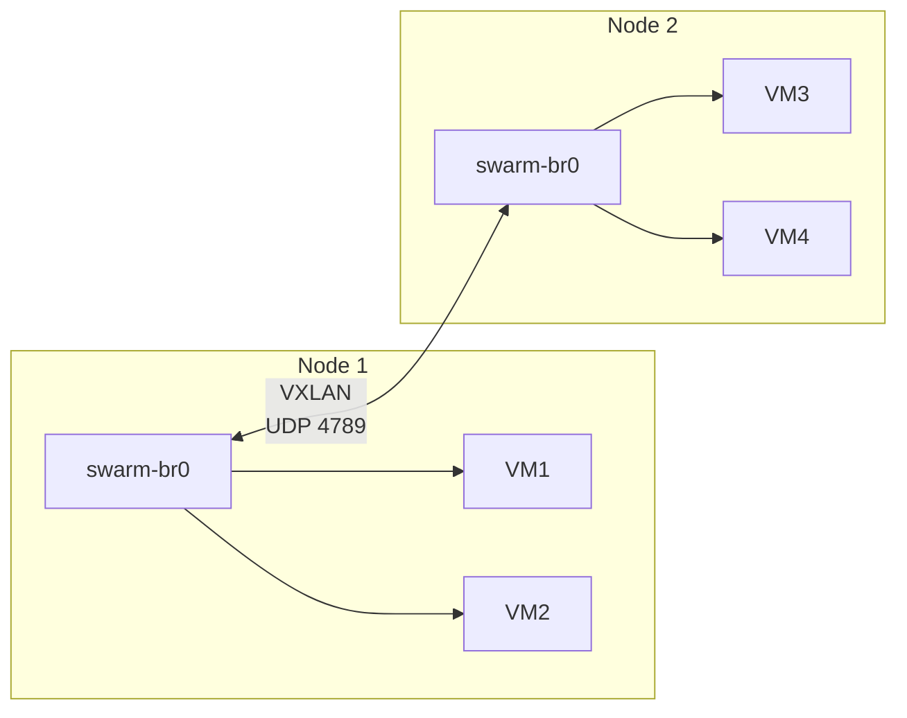

# Architecture Overview

> System design, components, and integration details.

---

## System Architecture

---

## Components

### SwarmKit Manager

| Component | Purpose |
|-----------|---------|
| **Raft Consensus** | Distributed decision making |
| **Scheduler** | Assigns tasks to workers |
| **State Store** | In-memory cluster state |
| **Control API** | gRPC for `swarmctl` |

### SwarmKit Worker

| Component | Purpose |
|-----------|---------|
| **Agent** | Communicates with manager |
| **Executor** | Runs tasks (SwarmCracker) |
| **Status Reporter** | Reports task state |

### SwarmCracker Executor

| Component | Purpose |
|-----------|---------|
| **Task Translator** | SwarmKit task → Firecracker config |
| **VM Manager** | Start/stop microVMs |
| **Network Setup** | TAP devices, bridges |
| **Jailer Integration** | Security sandboxing |

---

## Data Flow

### Task Execution Flow

---

## Packages

| Package | Description |
|---------|-------------|
| `pkg/config` | Configuration parsing |
| `pkg/executor` | SwarmKit executor implementation |
| `pkg/translator` | Task → Firecracker config translation |
| `pkg/network` | TAP/bridge/VXLAN setup |
| `pkg/jailer` | Security sandboxing |
| `pkg/storage` | Rootfs/volume management |
| `pkg/snapshot` | VM state persistence |
| `pkg/metrics` | Prometheus metrics |
| `pkg/swarmkit` | SwarmKit integration |

---

## Security Model

### Jailer Isolation

---

## Networking Model

### Single Node

### Multi-Node (VXLAN)

---

## Resource Limits

| Resource | Default | Configurable |
|----------|---------|--------------|
| VM vCPUs | 2 | `default_vcpus` |
| VM Memory | 1024 MB | `default_memory_mb` |
| VM Disk | 1 GB | rootfs size |
| CPU Quota | 100% | `cgroup.cpu_quota` |
| Memory Limit | VM RAM | `cgroup.memory_limit` |

---

## Related Documentation

| Topic | Document |
|-------|----------|
| SwarmKit integration | [SwarmKit Integration](swarmkit.md) |

---

**See Also:** [Getting Started](../getting-started/) | [Guides](../guides/) | [User Docs Home](../README.md)